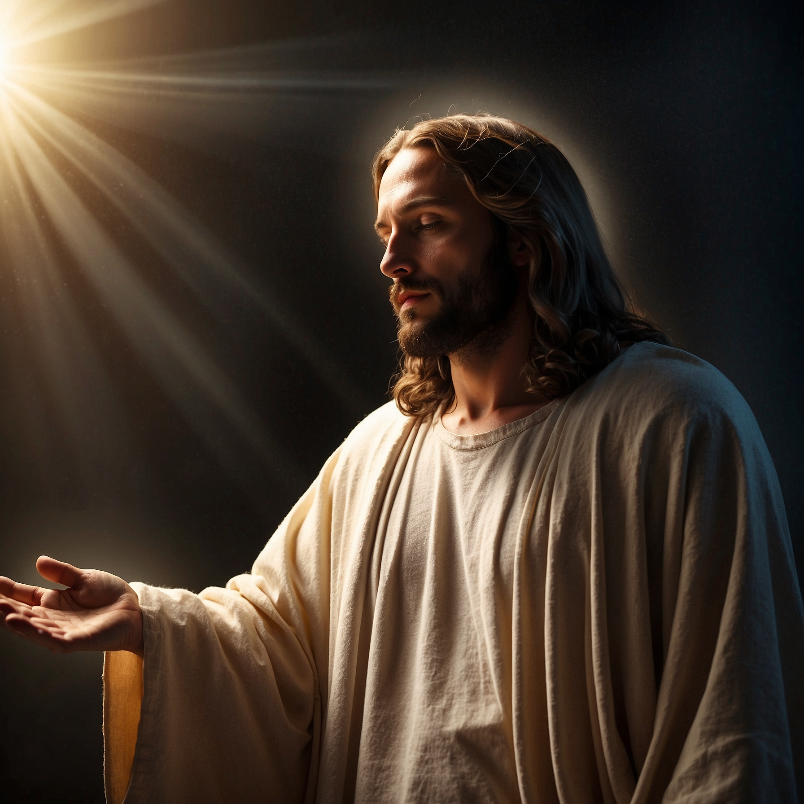
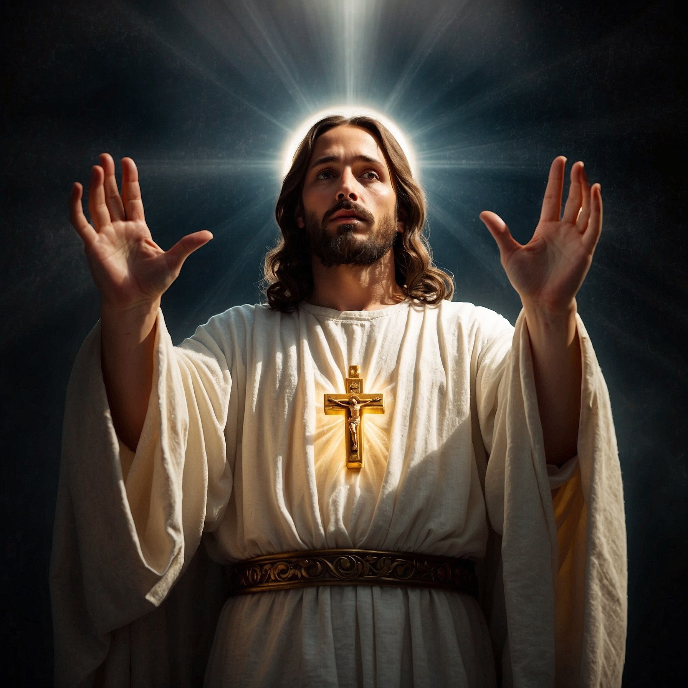
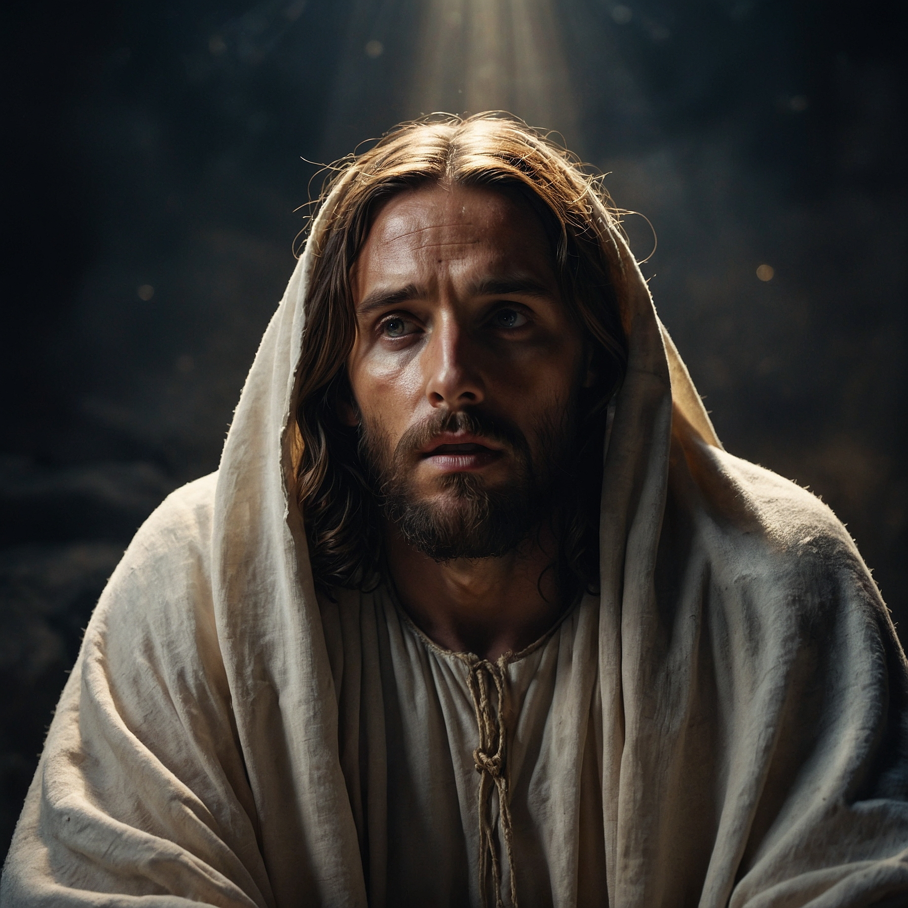
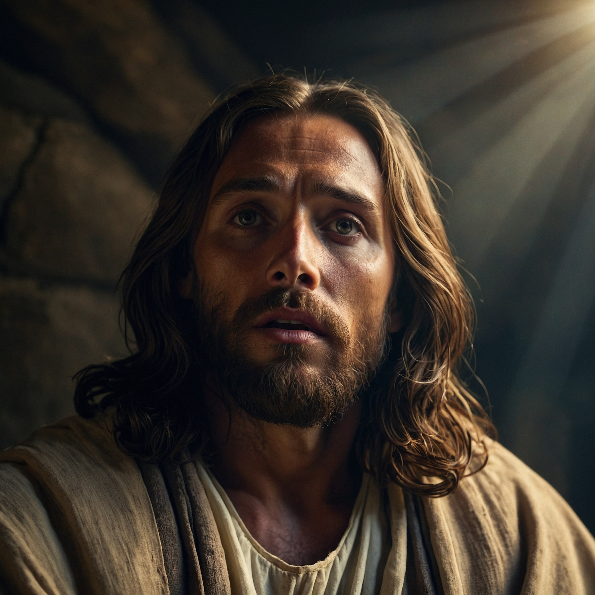
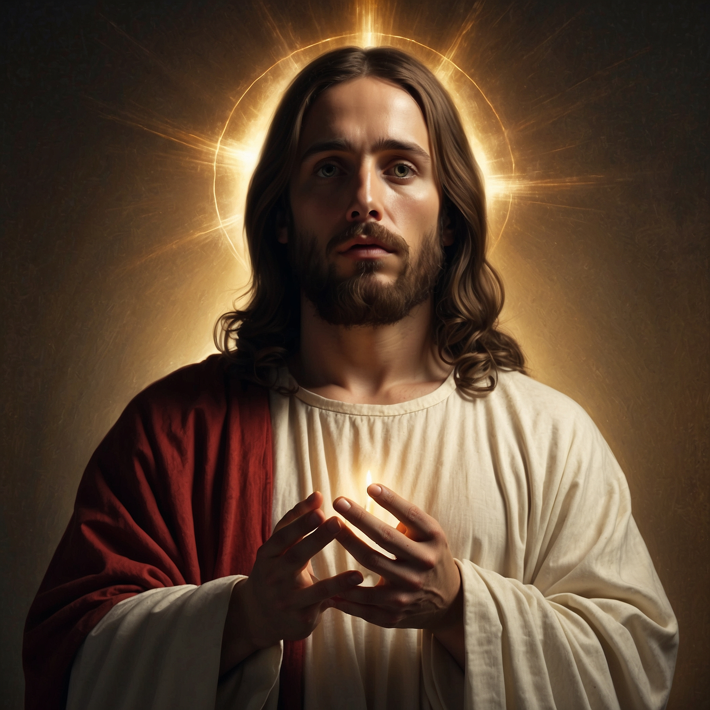
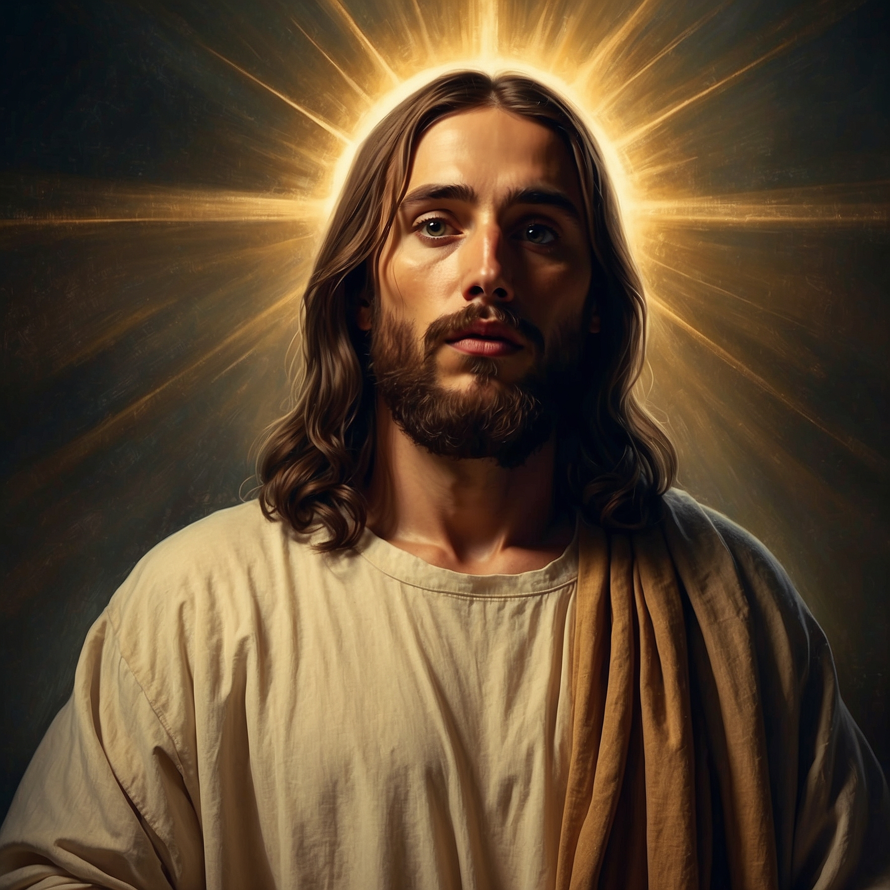
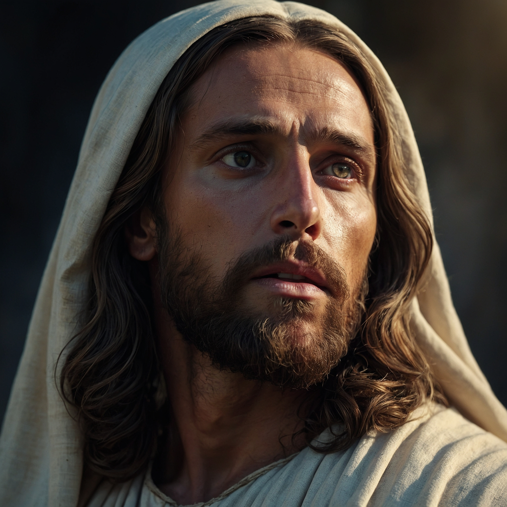
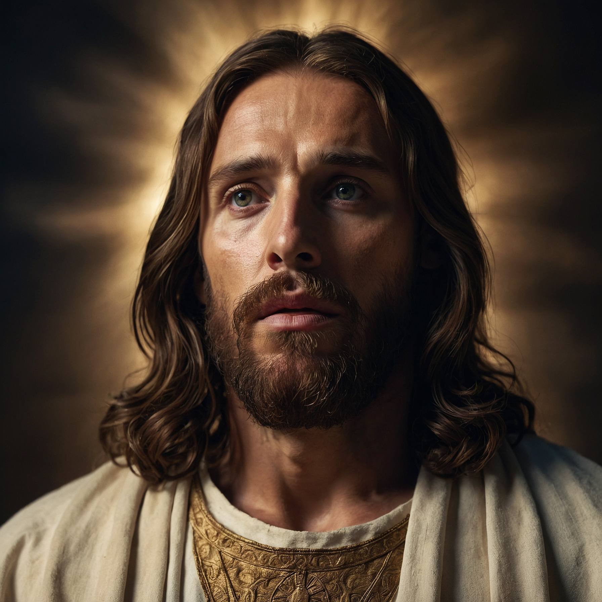

# Sacred AI Images

AI-generated religious artwork created with Leonardo.ai, featuring reverent and dignified portrayals of sacred themes.

## About

This repository contains 12 AI-generated images based on historical religious artwork. Each image was created using Leonardo.ai's PhotoReal v2 and Alchemy models with carefully crafted prompts emphasizing:

- Sacred art style
- Divine lighting
- Reverent composition
- Spiritual atmosphere
- Classical religious painting techniques

## Generated Images

1. 
2. 
3. 
4. 
5. 
6. 
7. 
8. 
9. 
10. 
11. 
12. 

## Generation Details

- **Total Images**: 12
- **Models Used**: Leonardo Kino XL (PhotoReal v2 & Alchemy)
- **Generation Date**: 2025-11-02
- **Source**: Replit Agent with Leonardo.ai API

## Repository Statistics

- ✅ Successfully uploaded: 12
- ❌ Failed uploads: 0

---

*Generated automatically by Replit Agent*
